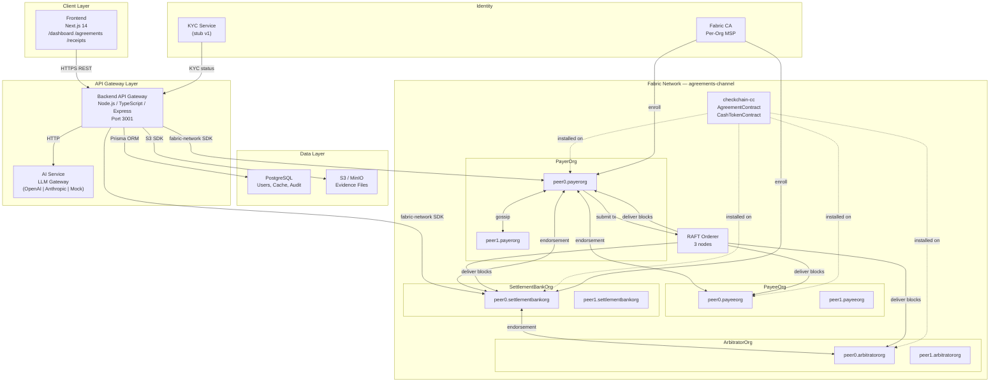
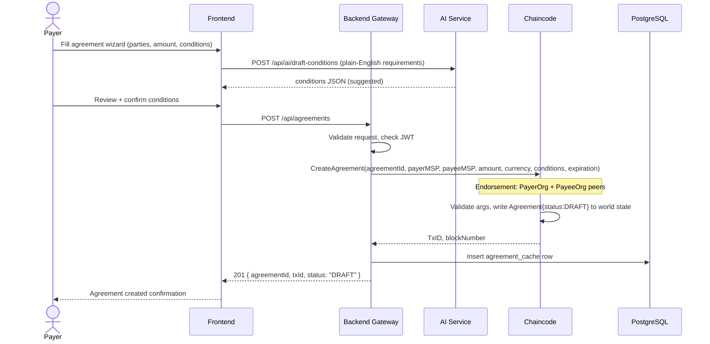
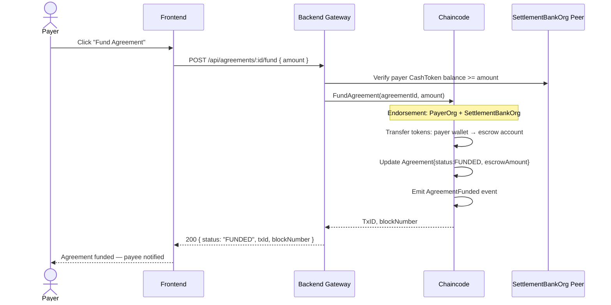
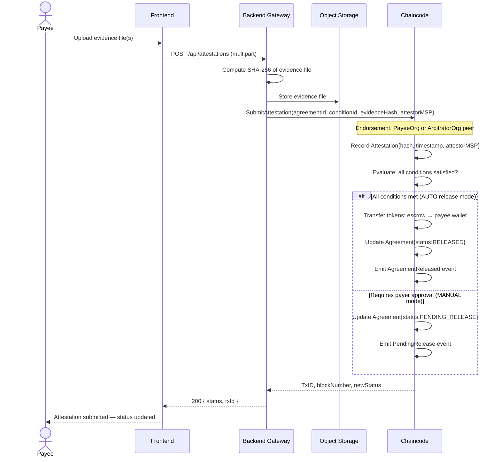
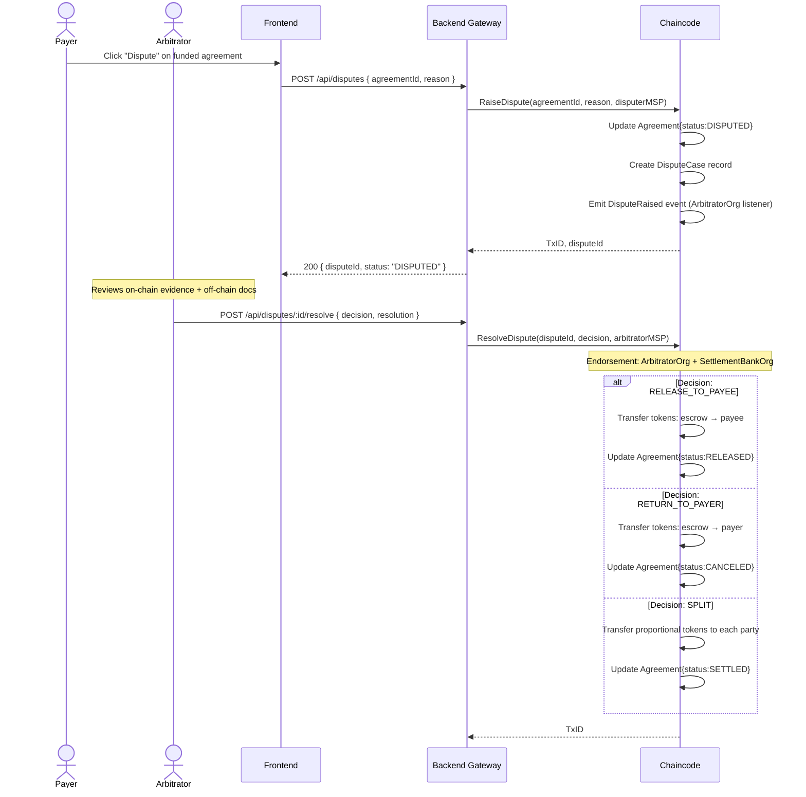

# System Architecture — CheckChain

**Version:** 1.0  
**Date:** 2026-01-15

---

## Table of Contents

1. [Component Overview](#1-component-overview)
2. [Hyperledger Fabric Network Design](#2-hyperledger-fabric-network-design)
3. [Component Architecture Diagram](#3-component-architecture-diagram)
4. [Data Flow Diagrams](#4-data-flow-diagrams)
5. [Technology Stack](#5-technology-stack)
6. [Security Architecture](#6-security-architecture)
7. [Deployment Architecture](#7-deployment-architecture)

---

## 1. Component Overview

CheckChain is composed of five layers:

| Layer | Technology | Responsibility |
|-------|-----------|---------------|
| **Blockchain** | Hyperledger Fabric 2.5 | Immutable agreement ledger, token accounting, access control |
| **Chaincode** | Go + fabric-contract-api-go | AgreementContract, CashTokenContract business logic |
| **Backend Gateway** | Node.js 20 / TypeScript / Express | REST API, Fabric SDK gateway, event listener, identity management |
| **Frontend** | Next.js 14 / Tailwind / shadcn/ui | Payer + Payee portals, AI tools, receipt viewer |
| **AI Service** | LLM Gateway (OpenAI / Anthropic / Mock) | Clause generation, explainability, risk scoring, dispute assistance |

Off-chain supporting services:

| Service | Technology | Responsibility |
|---------|-----------|---------------|
| **Database** | PostgreSQL 16 | User accounts, agreement cache, evidence metadata, audit log |
| **Object Storage** | AWS S3 (or MinIO for dev) | Evidence files; only SHA-256 hashes go on-chain |
| **Identity / CA** | Hyperledger Fabric CA | Org-level enrollment, MSP certificate management |
| **KYC Service** | Stub (v1); Alloy/Sardine (v2) | Identity verification gating token wallet activation |

---

## 2. Hyperledger Fabric Network Design

### 2.1 Organizations

| Org | MSP ID | Role | Peers |
|-----|--------|------|-------|
| PayerOrg | PayerOrgMSP | Represents payer-side participants | 2 peers (peer0, peer1) |
| PayeeOrg | PayeeOrgMSP | Represents payee-side participants | 2 peers (peer0, peer1) |
| SettlementBankOrg | SettlementBankOrgMSP | Licensed bank; mints/burns CashTokens | 2 peers (peer0, peer1) |
| ArbitratorOrg | ArbitratorOrgMSP | Neutral dispute resolution | 2 peers (peer0, peer1) |

> **MVP Note:** The dev network scaffold in `fabric-network/` starts with PayerOrg + SettlementBankOrg only. PayeeOrg and ArbitratorOrg are added by modifying `configtx.yaml` following the documented procedure.

### 2.2 Ordering Service

- **Type:** RAFT (crash fault tolerant)
- **Orderer nodes:** 3 orderer nodes (OrdererOrg) for production; 1 orderer in dev network
- **Block parameters:** `BatchTimeout: 2s`, `MaxMessageCount: 500`, `AbsoluteMaxBytes: 99MB`

### 2.3 Channel Design

```
Channel: agreements-channel
  ├── Members: PayerOrg, PayeeOrg, SettlementBankOrg, ArbitratorOrg
  ├── Chaincode: checkchain-cc (AgreementContract + CashTokenContract)
  └── Private Data Collections:
        ├── agreementTermsPDC       — sensitive contract clauses (PayerOrg + PayeeOrg only)
        ├── tokenBalancesPDC        — individual wallet balances (SettlementBankOrg only)
        └── kycStatusPDC            — KYC verification records (SettlementBankOrg + read by all for gating)
```

### 2.4 Private Data Collections

| Collection | Members | Purpose | Block-to-Live |
|-----------|---------|---------|---------------|
| `agreementTermsPDC` | PayerOrg, PayeeOrg | Full condition text, private notes, legal attachments | 0 (infinite) |
| `tokenBalancesPDC` | SettlementBankOrg | Individual CashToken balances (privacy) | 0 |
| `kycStatusPDC` | SettlementBankOrg (write), all (read via function) | KYC approval status per participant | 0 |

### 2.5 Endorsement Policies

| Chaincode Function | Endorsement Policy |
|-------------------|--------------------|
| `CreateAgreement` | `AND(PayerOrgMSP.peer, PayeeOrgMSP.peer)` |
| `FundAgreement` | `AND(PayerOrgMSP.peer, SettlementBankOrgMSP.peer)` |
| `SubmitAttestation` | `OR(PayeeOrgMSP.peer, ArbitratorOrgMSP.peer)` |
| `ReleaseFunds` | `AND(SettlementBankOrgMSP.peer, OR(PayeeOrgMSP.peer, ArbitratorOrgMSP.peer))` |
| `RaiseDispute` | `OR(PayerOrgMSP.peer, PayeeOrgMSP.peer)` |
| `ResolveDispute` | `AND(ArbitratorOrgMSP.peer, SettlementBankOrgMSP.peer)` |
| `Mint` / `Burn` | `AND(SettlementBankOrgMSP.peer)` (bank-only) |
| `CancelAgreement` | `AND(PayerOrgMSP.peer, PayeeOrgMSP.peer)` |

---

## 3. Component Architecture Diagram



---

## 4. Data Flow Diagrams

### 4.1 Create Agreement Flow



### 4.2 Fund Agreement Flow



### 4.3 Attest and Release Flow



### 4.4 Dispute Flow



---

## 5. Technology Stack

| Component | Technology | Version | Rationale |
|-----------|-----------|---------|-----------|
| Blockchain | Hyperledger Fabric | 2.5 LTS | Permissioned ledger; MSP-based access control; private data collections |
| Chaincode | Go + fabric-contract-api-go | 1.22 / 0.1.0 | Type-safe contract API; strong performance; standard Fabric choice |
| Ordering | RAFT | — | CFT; no external ZooKeeper dependency; production-ready in Fabric 2.x |
| Backend runtime | Node.js | 20 LTS | Fabric Node SDK (fabric-network) native support |
| Backend framework | Express | 4.x | Lightweight; middleware ecosystem; well-understood |
| Backend language | TypeScript | 5.x | Type safety across API + SDK layer |
| ORM | Prisma | 5.x | Type-safe queries; schema-first; excellent migration tooling |
| Database | PostgreSQL | 16 | ACID compliance; JSON support for agreement metadata |
| Frontend | Next.js | 14 (App Router) | Server components; excellent DX; Vercel-deployable |
| UI library | shadcn/ui + Tailwind | — | Accessible, unstyled components; full control over design |
| Forms | react-hook-form + zod | — | Schema-driven validation; performance |
| AI gateway | OpenAI API / Anthropic | gpt-4o / claude-3-5 | Clause generation, risk scoring, explanations |
| Object storage | AWS S3 / MinIO | — | Evidence file storage; only hashes on-chain |
| Container | Docker + Docker Compose | — | Reproducible dev environment |

---

## 6. Security Architecture

### 6.1 Identity & Authentication

- **On-chain identity:** Fabric CA issues x.509 certificates per org. Each API call to Fabric uses an enrolled identity from the org's wallet. MSP ID extracted from certificate in `ctx.GetClientIdentity().GetMSPID()`.
- **API authentication:** JWT tokens (RS256) issued by backend auth service. Each token encodes `orgMSP`, `userId`, `role`.
- **KYC gating:** Token wallet activation requires KYC approval status in `kycStatusPDC`. Chaincode reads this PDC before any `Mint` or `FundAgreement` call.

### 6.2 Data Privacy

- Sensitive agreement terms stored in `agreementTermsPDC` — only PayerOrg + PayeeOrg peers hold the data. SettlementBankOrg and ArbitratorOrg see only the public Agreement record.
- Evidence files stored in S3 with server-side encryption (AES-256). On-chain: SHA-256 hash only.
- Wallet balances in `tokenBalancesPDC` — SettlementBankOrg only. Other orgs query balances via authorized chaincode function that returns only the caller's own balance.

### 6.3 Threat Model Notes

| Threat | Mitigation |
|--------|-----------|
| Fake attestation submission | SHA-256 hash of evidence stored on-chain; off-chain file must match |
| Unauthorized fund release | Endorsement policy requires SettlementBankOrg + PayeeOrg/ArbitratorOrg |
| Replay attacks | Fabric's per-transaction nonce + proposal response mechanism prevents replay |
| Malicious org peer | RAFT ordering requires majority orderer nodes; single org cannot unilaterally order blocks |
| API injection | Parameterized Prisma queries; chaincode arg validation; zod input validation at API layer |

---

## 7. Deployment Architecture

### 7.1 Development (MOCK_FABRIC=true)

```
localhost
├── Backend (port 3001) — MOCK_FABRIC=true returns simulated responses
├── Frontend (port 3000) — Next.js dev server
├── PostgreSQL (port 5432) — Docker
└── MinIO (port 9000) — Docker (S3-compatible)
```

### 7.2 Development (Real Fabric Network)

```
localhost
├── Backend (port 3001) — MOCK_FABRIC=false, connects to Fabric
├── Frontend (port 3000)
├── PostgreSQL (port 5432) — Docker
├── MinIO (port 9000) — Docker
└── Fabric Network (Docker Compose)
    ├── orderer.example.com (port 7050)
    ├── peer0.payerorg.example.com (port 7051)
    ├── peer0.settlementbankorg.example.com (port 9051)
    ├── ca.payerorg.example.com (port 7054)
    └── ca.settlementbankorg.example.com (port 8054)
```

### 7.3 Production

```
Cloud (AWS / GCP)
├── EKS / GKE — Backend API (3 replicas, HPA)
├── Vercel / CloudFront — Frontend (CDN-distributed)
├── RDS PostgreSQL (Multi-AZ)
├── S3 (evidence storage)
├── Fabric Network (dedicated VMs or Kubernetes)
│   ├── Managed via Hyperledger Bevel or IBM Blockchain Platform
│   └── Each org operates their own infrastructure
└── AI Gateway — OpenAI / Anthropic API (behind rate limiter)
```
