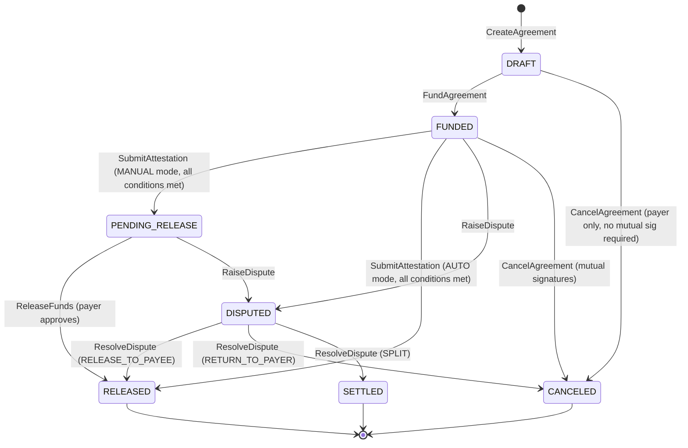
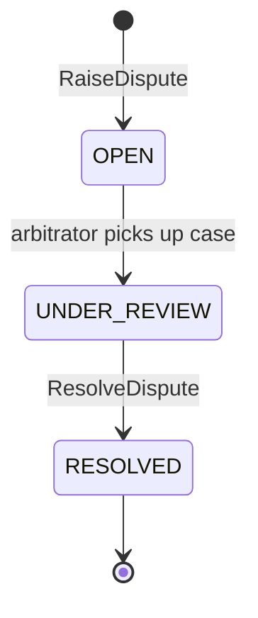

# Chaincode Specification — CheckChain

**Chaincode name:** `checkchain-cc`  
**Language:** Go  
**Fabric Contract API:** `github.com/hyperledger/fabric-contract-api-go v1.2.1`  
**Version:** 1.0  

---

## Table of Contents

1. [Asset Structures](#1-asset-structures)
2. [State Machine](#2-state-machine)
3. [AgreementContract Functions](#3-agreementcontract-functions)
4. [CashTokenContract Functions](#4-cashtokencontract-functions)
5. [Chaincode Events](#5-chaincode-events)
6. [Private Data Collections](#6-private-data-collections)
7. [Endorsement Policies](#7-endorsement-policies)
8. [World State Key Schema](#8-world-state-key-schema)

---

## 1. Asset Structures

### 1.1 Agreement (Public World State)

```json
{
  "agreementId": "AGT-2026-0001",
  "assetType": "Agreement",
  "payerMSP": "PayerOrgMSP",
  "payerAddress": "user@payerorg.example.com",
  "payeeMSP": "PayeeOrgMSP",
  "payeeAddress": "contractor@payeeorg.example.com",
  "amount": "5000.00",
  "currency": "USD",
  "releaseMode": "AUTO",
  "status": "FUNDED",
  "escrowAmount": "5000.00",
  "createdAt": "2026-01-15T10:00:00Z",
  "updatedAt": "2026-01-15T14:32:00Z",
  "expiresAt": "2026-03-15T10:00:00Z",
  "conditionCount": 2,
  "satisfiedConditionCount": 1,
  "disputeId": "",
  "releaseTxId": "",
  "releaseBlockNumber": 0,
  "cancelSignatures": []
}
```

**Status values:** `DRAFT` → `FUNDED` → `PENDING_RELEASE` → `RELEASED` | `DISPUTED` → `SETTLED` | `CANCELED`

### 1.2 AgreementTerms (Private Data — agreementTermsPDC)

```json
{
  "agreementId": "AGT-2026-0001",
  "conditions": [
    {
      "conditionId": "COND-001",
      "type": "DELIVERABLE",
      "description": "Final inspection report signed by licensed inspector",
      "requiredAttestors": ["PayeeOrgMSP"],
      "satisfied": false,
      "satisfiedAt": "",
      "evidenceHash": ""
    },
    {
      "conditionId": "COND-002",
      "type": "DATE",
      "description": "Completion by 2026-02-28",
      "deadline": "2026-02-28T23:59:59Z",
      "satisfied": false
    }
  ],
  "privateNotes": "Landlord-contractor agreement for unit 4B renovation.",
  "attachmentHashes": []
}
```

### 1.3 CashToken (Private Data — tokenBalancesPDC)

```json
{
  "walletId": "wallet:PayerOrgMSP:user@payerorg.example.com",
  "assetType": "CashToken",
  "ownerMSP": "PayerOrgMSP",
  "ownerAddress": "user@payerorg.example.com",
  "balance": "12500.00",
  "currency": "USD",
  "kycVerified": true,
  "createdAt": "2026-01-10T08:00:00Z",
  "updatedAt": "2026-01-15T14:32:00Z"
}
```

### 1.4 Attestation (Public World State)

```json
{
  "attestationId": "ATT-2026-0001-COND-001",
  "assetType": "Attestation",
  "agreementId": "AGT-2026-0001",
  "conditionId": "COND-001",
  "attestorMSP": "PayeeOrgMSP",
  "attestorAddress": "contractor@payeeorg.example.com",
  "evidenceHash": "a4f2e8c1d9b3f7e2a5c8d4e9f1b2c3d4e5f6a7b8c9d0e1f2a3b4c5d6e7f8a9b0",
  "evidenceURI": "s3://checkchain-evidence/AGT-2026-0001/inspection-report.pdf",
  "submittedAt": "2026-01-20T09:15:00Z",
  "txId": "7a3f2b1c9d8e4f5a6b7c8d9e0f1a2b3c4d5e6f7a8b9c0d1e2f3a4b5c6d7e8f9a0b",
  "blockNumber": 47
}
```

### 1.5 DisputeCase (Public World State)

```json
{
  "disputeId": "DISP-2026-0001",
  "assetType": "DisputeCase",
  "agreementId": "AGT-2026-0001",
  "raisedByMSP": "PayerOrgMSP",
  "raisedByAddress": "user@payerorg.example.com",
  "reason": "Inspection report does not cover scope items 3 and 4 in the agreement.",
  "status": "OPEN",
  "raisedAt": "2026-01-22T11:00:00Z",
  "resolvedAt": "",
  "arbitratorMSP": "ArbitratorOrgMSP",
  "decision": "",
  "resolution": "",
  "splitRatio": ""
}
```

---

## 2. State Machine

### 2.1 Agreement Status Transitions



### 2.2 DisputeCase Status Transitions



---

## 3. AgreementContract Functions

### 3.1 CreateAgreement

**Signature:**
```go
func (c *AgreementContract) CreateAgreement(
    ctx contractapi.TransactionContextInterface,
    agreementId string,
    payeeMSP string,
    payeeAddress string,
    amount string,
    currency string,
    conditionsJSON string,  // JSON array of Condition structs
    releaseMode string,     // "AUTO" | "MANUAL"
    expiresAt string,       // RFC3339
) (*Agreement, error)
```

**Access control:** Caller must be from `PayerOrgMSP`. Payee must acknowledge (or endorsement policy enforces PayeeOrg peer endorsement).

**Validation:**
- `agreementId` matches pattern `AGT-\d{4}-\d{4}`
- `amount` parses to positive decimal
- `currency` is `"USD"` (v1)
- `conditionsJSON` validates against Condition schema
- `expiresAt` is in the future
- Agreement with same ID does not already exist

**World state writes:**
- `AGREEMENT:AGT-2026-0001` → public Agreement record (status: `DRAFT`)
- `agreementTermsPDC` → AgreementTerms (private)

**Emitted event:** `AgreementCreated`

---

### 3.2 FundAgreement

**Signature:**
```go
func (c *AgreementContract) FundAgreement(
    ctx contractapi.TransactionContextInterface,
    agreementId string,
    amount string,
) error
```

**Access control:** Caller must be from `PayerOrgMSP` and must be the payer on the agreement.

**Validation:**
- Agreement exists and status is `DRAFT`
- Amount matches agreement amount
- Payer CashToken balance ≥ amount (reads `tokenBalancesPDC` via cross-contract call to CashTokenContract)
- Payer KYC verified (reads `kycStatusPDC`)
- Agreement not expired

**World state writes:**
- Deducts from payer wallet in `tokenBalancesPDC`
- Creates escrow entry: `ESCROW:AGT-2026-0001`
- Updates Agreement `status: FUNDED`, `escrowAmount`

**Emitted event:** `AgreementFunded`

---

### 3.3 SubmitAttestation

**Signature:**
```go
func (c *AgreementContract) SubmitAttestation(
    ctx contractapi.TransactionContextInterface,
    agreementId string,
    conditionId string,
    evidenceHash string,   // SHA-256 hex string
    evidenceURI string,    // S3 URI (off-chain reference)
) (*Attestation, error)
```

**Access control:** Caller must be from `PayeeOrgMSP` or `ArbitratorOrgMSP`. For multi-party conditions, all required attestors must have submitted.

**Validation:**
- Agreement exists, status is `FUNDED` or `PENDING_RELEASE`
- Condition exists in AgreementTerms PDC
- Condition not already satisfied
- `evidenceHash` is valid 64-char hex SHA-256
- Agreement not expired

**World state writes:**
- `ATTESTATION:AGT-2026-0001:COND-001` → Attestation record
- Updates condition `satisfied: true`, `satisfiedAt`, `evidenceHash` in `agreementTermsPDC`
- Increments `satisfiedConditionCount` on Agreement
- If all conditions satisfied:
  - `AUTO` mode: calls `releaseFundsInternal()` → status `RELEASED`
  - `MANUAL` mode: status → `PENDING_RELEASE`

**Emitted events:** `AttestationSubmitted`, optionally `AgreementReleased` or `PendingRelease`

---

### 3.4 ReleaseFunds

**Signature:**
```go
func (c *AgreementContract) ReleaseFunds(
    ctx contractapi.TransactionContextInterface,
    agreementId string,
) error
```

**Access control:** Caller must be from `PayerOrgMSP` (manual approval) or `ArbitratorOrgMSP` (forced release after dispute resolution). Endorsement requires SettlementBankOrg peer.

**Validation:**
- Agreement status is `PENDING_RELEASE` or `DISPUTED` with arbitrator decision `RELEASE_TO_PAYEE`
- All conditions verified as satisfied

**World state writes:**
- Transfers escrow tokens to payee wallet in `tokenBalancesPDC`
- Updates Agreement: `status: RELEASED`, `releaseTxId`, `releaseBlockNumber`
- Clears escrow entry

**Emitted event:** `AgreementReleased`

---

### 3.5 RaiseDispute

**Signature:**
```go
func (c *AgreementContract) RaiseDispute(
    ctx contractapi.TransactionContextInterface,
    agreementId string,
    reason string,
) (*DisputeCase, error)
```

**Access control:** Caller must be from `PayerOrgMSP` or `PayeeOrgMSP` and a party to the agreement.

**Validation:**
- Agreement status is `FUNDED` or `PENDING_RELEASE`
- No existing open dispute on agreement
- `reason` is non-empty, < 1000 chars

**World state writes:**
- `DISPUTE:DISP-2026-0001` → DisputeCase record
- Updates Agreement: `status: DISPUTED`, `disputeId`

**Emitted event:** `DisputeRaised`

---

### 3.6 ResolveDispute

**Signature:**
```go
func (c *AgreementContract) ResolveDispute(
    ctx contractapi.TransactionContextInterface,
    disputeId string,
    decision string,      // "RELEASE_TO_PAYEE" | "RETURN_TO_PAYER" | "SPLIT"
    resolution string,    // Free-text explanation
    splitRatio string,    // "60:40" if SPLIT (payee:payer)
) error
```

**Access control:** Caller must be from `ArbitratorOrgMSP`. Endorsement requires `SettlementBankOrgMSP` peer.

**Validation:**
- DisputeCase exists with status `OPEN` or `UNDER_REVIEW`
- `decision` is one of allowed values
- If `SPLIT`, `splitRatio` parses to two non-negative integers summing to 100

**World state writes:**
- Based on decision: transfer escrow tokens (full or split) to respective parties
- Updates DisputeCase: `status: RESOLVED`, `decision`, `resolution`, `resolvedAt`
- Updates Agreement: `status: RELEASED | CANCELED | SETTLED`

**Emitted event:** `DisputeResolved`

---

### 3.7 CancelAgreement

**Signature:**
```go
func (c *AgreementContract) CancelAgreement(
    ctx contractapi.TransactionContextInterface,
    agreementId string,
) error
```

**Access control:**
- If status is `DRAFT`: payer alone can cancel (single-party)
- If status is `FUNDED`: requires mutual consent. First caller sets cancel flag; second caller executes. Endorsement policy requires `AND(PayerOrgMSP.peer, PayeeOrgMSP.peer)`.

**World state writes:**
- If `FUNDED`: returns escrow to payer wallet
- Updates Agreement: `status: CANCELED`

**Emitted event:** `AgreementCanceled`

---

### 3.8 GetAgreement

**Signature:**
```go
func (c *AgreementContract) GetAgreement(
    ctx contractapi.TransactionContextInterface,
    agreementId string,
) (*Agreement, error)
```

**Access control:** Any enrolled org member. Returns public Agreement; does NOT return AgreementTerms PDC.

---

### 3.9 GetAgreementWithTerms

**Signature:**
```go
func (c *AgreementContract) GetAgreementWithTerms(
    ctx contractapi.TransactionContextInterface,
    agreementId string,
) (*AgreementWithTerms, error)
```

**Access control:** Caller must be from `PayerOrgMSP` or `PayeeOrgMSP` and a party to the agreement.

Returns public Agreement + private AgreementTerms from PDC.

---

### 3.10 QueryAgreementsByParty

**Signature:**
```go
func (c *AgreementContract) QueryAgreementsByParty(
    ctx contractapi.TransactionContextInterface,
    mspId string,
    address string,
    statusFilter string,   // "" for all, or "FUNDED", "RELEASED", etc.
) ([]*Agreement, error)
```

**Access control:** Caller can only query agreements where they are a party. Uses CouchDB rich query (requires CouchDB state database).

**CouchDB selector:**
```json
{
  "selector": {
    "assetType": "Agreement",
    "$or": [
      { "payerMSP": "PayerOrgMSP", "payerAddress": "user@payerorg.example.com" },
      { "payeeMSP": "PayerOrgMSP", "payeeAddress": "user@payerorg.example.com" }
    ]
  }
}
```

---

## 4. CashTokenContract Functions

### 4.1 Mint

**Signature:**
```go
func (c *CashTokenContract) Mint(
    ctx contractapi.TransactionContextInterface,
    ownerMSP string,
    ownerAddress string,
    amount string,
    currency string,
) error
```

**Access control:** Caller MUST be from `SettlementBankOrgMSP`. Rejects all other callers.

**Validation:**
- Amount is positive decimal
- `currency` is `"USD"` (v1)
- Owner exists and KYC verified (reads `kycStatusPDC`)

**World state writes:**
- Creates or updates wallet in `tokenBalancesPDC`
- Increments `totalSupply` counter

**Emitted event:** `TokensMinted`

---

### 4.2 Burn

**Signature:**
```go
func (c *CashTokenContract) Burn(
    ctx contractapi.TransactionContextInterface,
    ownerMSP string,
    ownerAddress string,
    amount string,
) error
```

**Access control:** `SettlementBankOrgMSP` only.

**World state writes:**
- Decrements balance in `tokenBalancesPDC`
- Decrements `totalSupply`

**Emitted event:** `TokensBurned`

---

### 4.3 Transfer (Internal)

```go
func (c *CashTokenContract) Transfer(
    ctx contractapi.TransactionContextInterface,
    fromMSP string,
    fromAddress string,
    toMSP string,
    toAddress string,
    amount string,
) error
```

**Access control:** Only callable from within the same chaincode (via `invokeChaincode` or directly from AgreementContract internal calls). Not exposed as a direct external call to prevent unauthorized transfers.

---

### 4.4 BalanceOf

```go
func (c *CashTokenContract) BalanceOf(
    ctx contractapi.TransactionContextInterface,
    ownerMSP string,
    ownerAddress string,
) (string, error)
```

**Access control:** Caller can only query their own balance (MSP ID check). `SettlementBankOrgMSP` can query any balance.

---

### 4.5 TotalSupply

```go
func (c *CashTokenContract) TotalSupply(
    ctx contractapi.TransactionContextInterface,
) (string, error)
```

**Access control:** `SettlementBankOrgMSP` only.

---

## 5. Chaincode Events

| Event Name | Payload Fields | Emitted By |
|-----------|---------------|-----------|
| `AgreementCreated` | `agreementId`, `payerMSP`, `payeeMSP`, `amount`, `currency` | CreateAgreement |
| `AgreementFunded` | `agreementId`, `amount`, `txId` | FundAgreement |
| `AttestationSubmitted` | `agreementId`, `conditionId`, `attestorMSP`, `evidenceHash` | SubmitAttestation |
| `PendingRelease` | `agreementId`, `satisfiedCount`, `totalCount` | SubmitAttestation |
| `AgreementReleased` | `agreementId`, `payeeMSP`, `amount`, `txId`, `blockNumber` | ReleaseFunds / SubmitAttestation |
| `DisputeRaised` | `disputeId`, `agreementId`, `raisedByMSP`, `reason` | RaiseDispute |
| `DisputeResolved` | `disputeId`, `agreementId`, `decision` | ResolveDispute |
| `AgreementCanceled` | `agreementId`, `canceledByMSP` | CancelAgreement |
| `TokensMinted` | `ownerMSP`, `ownerAddress`, `amount` | Mint |
| `TokensBurned` | `ownerMSP`, `ownerAddress`, `amount` | Burn |

---

## 6. Private Data Collections

Defined in `collections_config.json` (deployed with chaincode):

```json
[
  {
    "name": "agreementTermsPDC",
    "policy": "OR('PayerOrgMSP.member', 'PayeeOrgMSP.member')",
    "requiredPeerCount": 1,
    "maxPeerCount": 3,
    "blockToLive": 0,
    "memberOnlyRead": true,
    "memberOnlyWrite": false,
    "endorsementPolicy": {
      "signaturePolicy": "AND('PayerOrgMSP.member', 'PayeeOrgMSP.member')"
    }
  },
  {
    "name": "tokenBalancesPDC",
    "policy": "OR('SettlementBankOrgMSP.member')",
    "requiredPeerCount": 1,
    "maxPeerCount": 2,
    "blockToLive": 0,
    "memberOnlyRead": true,
    "memberOnlyWrite": true,
    "endorsementPolicy": {
      "signaturePolicy": "AND('SettlementBankOrgMSP.member')"
    }
  },
  {
    "name": "kycStatusPDC",
    "policy": "OR('SettlementBankOrgMSP.member')",
    "requiredPeerCount": 1,
    "maxPeerCount": 2,
    "blockToLive": 0,
    "memberOnlyRead": false,
    "memberOnlyWrite": true,
    "endorsementPolicy": {
      "signaturePolicy": "AND('SettlementBankOrgMSP.member')"
    }
  }
]
```

---

## 7. Endorsement Policies

Channel-level endorsement policy for all chaincode functions by default:
```
AND(PayerOrgMSP.peer, PayeeOrgMSP.peer, SettlementBankOrgMSP.peer)
```

Function-level overrides (via Fabric's state-based endorsement or lifecycle policy):

| Function | Policy |
|----------|--------|
| `CreateAgreement` | `AND('PayerOrgMSP.peer', 'PayeeOrgMSP.peer')` |
| `FundAgreement` | `AND('PayerOrgMSP.peer', 'SettlementBankOrgMSP.peer')` |
| `SubmitAttestation` | `OR('PayeeOrgMSP.peer', 'ArbitratorOrgMSP.peer')` |
| `ReleaseFunds` | `AND('SettlementBankOrgMSP.peer', OR('PayeeOrgMSP.peer', 'ArbitratorOrgMSP.peer'))` |
| `RaiseDispute` | `OR('PayerOrgMSP.peer', 'PayeeOrgMSP.peer')` |
| `ResolveDispute` | `AND('ArbitratorOrgMSP.peer', 'SettlementBankOrgMSP.peer')` |
| `CancelAgreement` | `AND('PayerOrgMSP.peer', 'PayeeOrgMSP.peer')` |
| `Mint`, `Burn` | `AND('SettlementBankOrgMSP.peer')` |

---

## 8. World State Key Schema

| Key Pattern | Asset Type | Example |
|-------------|-----------|---------|
| `AGREEMENT:{agreementId}` | Agreement | `AGREEMENT:AGT-2026-0001` |
| `ESCROW:{agreementId}` | Escrow balance | `ESCROW:AGT-2026-0001` |
| `ATTESTATION:{agreementId}:{conditionId}` | Attestation | `ATTESTATION:AGT-2026-0001:COND-001` |
| `DISPUTE:{disputeId}` | DisputeCase | `DISPUTE:DISP-2026-0001` |
| `TOTALSUPPLY:USD` | Total supply | — |
| PDC: `WALLET:{ownerMSP}:{ownerAddress}` | CashToken | `WALLET:PayerOrgMSP:user@payerorg.example.com` |
| PDC: `KYC:{mspId}:{address}` | KYC status | `KYC:PayerOrgMSP:user@payerorg.example.com` |
| PDC: `TERMS:{agreementId}` | AgreementTerms | `TERMS:AGT-2026-0001` |
