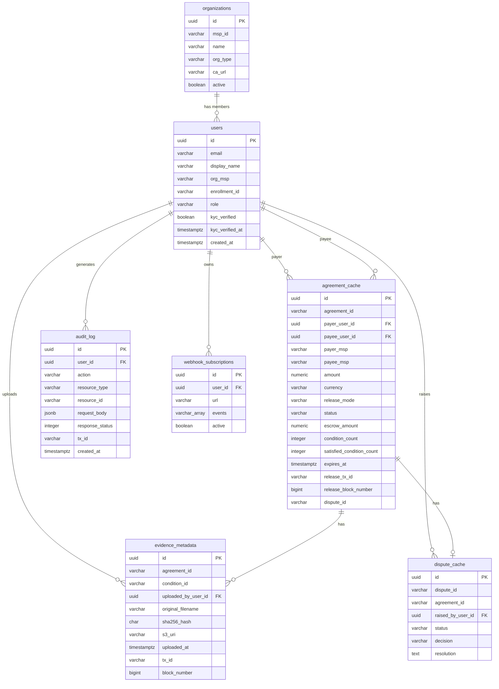

# Data Model — CheckChain

**Version:** 1.0  
**Date:** 2026-01-15

---

## Table of Contents

1. [Fabric World State Assets (JSON)](#1-fabric-world-state-assets-json)
2. [PostgreSQL Off-Chain Schema](#2-postgresql-off-chain-schema)
3. [Postgres ERD (Mermaid)](#3-postgres-erd)

---

## 1. Fabric World State Assets (JSON)

All on-chain assets are stored in the Fabric world state as JSON-encoded bytes. CouchDB is the required state database for rich queries.

### 1.1 Agreement (Public)

```json
{
  "agreementId": "AGT-2026-0001",
  "assetType": "Agreement",
  "payerMSP": "PayerOrgMSP",
  "payerAddress": "user@payerorg.example.com",
  "payeeMSP": "PayeeOrgMSP",
  "payeeAddress": "contractor@payeeorg.example.com",
  "amount": "5000.00",
  "currency": "USD",
  "releaseMode": "AUTO",
  "status": "FUNDED",
  "escrowAmount": "5000.00",
  "conditionCount": 2,
  "satisfiedConditionCount": 0,
  "createdAt": "2026-01-15T10:00:00Z",
  "updatedAt": "2026-01-15T14:32:00Z",
  "expiresAt": "2026-03-15T10:00:00Z",
  "fundedTxId": "9b2e4d6f8a0c2e4f6a8c0e2f4a6c8e0f",
  "fundedBlockNumber": 31,
  "releaseTxId": "",
  "releaseBlockNumber": 0,
  "disputeId": "",
  "cancelSignatures": []
}
```

**Composite key:** `AGREEMENT:{agreementId}`

| Field | Type | Notes |
|-------|------|-------|
| `agreementId` | string | Pattern: `AGT-YYYY-NNNN` |
| `assetType` | string | Fixed: `"Agreement"` |
| `payerMSP` | string | Fabric MSP ID |
| `payerAddress` | string | Enrollment ID |
| `payeeMSP` | string | Fabric MSP ID |
| `payeeAddress` | string | Enrollment ID |
| `amount` | string | Decimal string (avoids float precision issues) |
| `currency` | string | `"USD"` in v1 |
| `releaseMode` | string | `"AUTO"` \| `"MANUAL"` |
| `status` | string | See state machine in CHAINCODE_SPEC.md |
| `escrowAmount` | string | Tokens locked in escrow |
| `conditionCount` | int | Total number of conditions |
| `satisfiedConditionCount` | int | Conditions with satisfied = true |
| `cancelSignatures` | string[] | MSP IDs of parties that signed cancel |

---

### 1.2 AgreementTerms (Private — agreementTermsPDC)

```json
{
  "agreementId": "AGT-2026-0001",
  "conditions": [
    {
      "conditionId": "COND-001",
      "type": "DELIVERABLE",
      "description": "Final inspection report signed by a licensed inspector",
      "requiredAttestors": ["PayeeOrgMSP"],
      "satisfied": false,
      "satisfiedAt": "",
      "evidenceHash": "",
      "aiGenerated": true
    },
    {
      "conditionId": "COND-002",
      "type": "DATE",
      "description": "All work completed by February 28, 2026",
      "deadline": "2026-02-28T23:59:59Z",
      "satisfied": false,
      "satisfiedAt": ""
    }
  ],
  "privateNotes": "Unit 4B bathroom renovation. Contractor is bonded and insured.",
  "attachmentHashes": [
    "b5d7f9a1c3e5g7i9k1m3o5q7s9u1w3y5a7c9e1g3i5k7m9o1q3s5u7w9y1a3c5e7"
  ]
}
```

**Condition types:**

| Type | Required fields |
|------|----------------|
| `DELIVERABLE` | `description`, `requiredAttestors` |
| `DATE` | `description`, `deadline` |
| `MILESTONE` | `description`, `requiredAttestors`, `milestoneOrder` |
| `MULTIPARTY` | `description`, `requiredAttestors` (all must attest) |

---

### 1.3 CashToken Wallet (Private — tokenBalancesPDC)

```json
{
  "walletId": "WALLET:PayerOrgMSP:user@payerorg.example.com",
  "assetType": "CashToken",
  "ownerMSP": "PayerOrgMSP",
  "ownerAddress": "user@payerorg.example.com",
  "balance": "12500.00",
  "currency": "USD",
  "kycVerified": true,
  "createdAt": "2026-01-10T08:00:00Z",
  "updatedAt": "2026-01-15T14:32:00Z"
}
```

---

### 1.4 Escrow Balance (Public)

```json
{
  "escrowId": "ESCROW:AGT-2026-0001",
  "assetType": "Escrow",
  "agreementId": "AGT-2026-0001",
  "amount": "5000.00",
  "currency": "USD",
  "createdAt": "2026-01-15T14:32:00Z"
}
```

---

### 1.5 Attestation (Public)

```json
{
  "attestationId": "ATT-2026-0001-COND-001",
  "assetType": "Attestation",
  "agreementId": "AGT-2026-0001",
  "conditionId": "COND-001",
  "attestorMSP": "PayeeOrgMSP",
  "attestorAddress": "contractor@payeeorg.example.com",
  "evidenceHash": "a4f2e8c1d9b3f7e2a5c8d4e9f1b2c3d4e5f6a7b8c9d0e1f2a3b4c5d6e7f8a9b0",
  "evidenceURI": "s3://checkchain-evidence/AGT-2026-0001/inspection-report.pdf",
  "attestationNote": "Inspection by John Smith, License #12345",
  "submittedAt": "2026-01-20T09:15:00Z",
  "txId": "7a3f2b1c9d8e4f5a6b7c8d9e0f1a2b3c4d5e6f7a8b9c0d1e2f3a4b5c6d7e8f9a0b",
  "blockNumber": 47
}
```

---

### 1.6 DisputeCase (Public)

```json
{
  "disputeId": "DISP-2026-0001",
  "assetType": "DisputeCase",
  "agreementId": "AGT-2026-0001",
  "raisedByMSP": "PayerOrgMSP",
  "raisedByAddress": "user@payerorg.example.com",
  "reason": "Inspection report incomplete",
  "status": "OPEN",
  "raisedAt": "2026-01-22T11:00:00Z",
  "arbitratorMSP": "ArbitratorOrgMSP",
  "decision": "",
  "resolution": "",
  "splitRatio": "",
  "resolvedAt": ""
}
```

---

### 1.7 KYC Status (Private — kycStatusPDC)

```json
{
  "kycId": "KYC:PayerOrgMSP:user@payerorg.example.com",
  "ownerMSP": "PayerOrgMSP",
  "ownerAddress": "user@payerorg.example.com",
  "verified": true,
  "verifiedAt": "2026-01-10T08:00:00Z",
  "verifiedBy": "SettlementBankOrgMSP",
  "tier": "STANDARD",
  "maxSingleTxUSD": "50000.00",
  "maxDailyVolumeUSD": "100000.00"
}
```

---

## 2. PostgreSQL Off-Chain Schema

### 2.1 Table: `users`

| Column | Type | Constraints | Notes |
|--------|------|------------|-------|
| `id` | UUID | PK | Internal user ID |
| `email` | VARCHAR(255) | UNIQUE NOT NULL | Login identifier |
| `password_hash` | VARCHAR(255) | NOT NULL | bcrypt |
| `display_name` | VARCHAR(255) | NOT NULL | |
| `org_msp` | VARCHAR(100) | NOT NULL | Fabric MSP ID |
| `enrollment_id` | VARCHAR(255) | NOT NULL | Fabric CA enrollment |
| `role` | VARCHAR(50) | NOT NULL | PAYER, PAYEE, BANK, ARBITRATOR |
| `kyc_verified` | BOOLEAN | DEFAULT false | |
| `kyc_verified_at` | TIMESTAMPTZ | | |
| `wallet_address` | VARCHAR(255) | | Derived from enrollment |
| `created_at` | TIMESTAMPTZ | DEFAULT NOW() | |
| `updated_at` | TIMESTAMPTZ | DEFAULT NOW() | |

---

### 2.2 Table: `organizations`

| Column | Type | Constraints | Notes |
|--------|------|------------|-------|
| `id` | UUID | PK | |
| `msp_id` | VARCHAR(100) | UNIQUE NOT NULL | e.g., PayerOrgMSP |
| `name` | VARCHAR(255) | NOT NULL | Display name |
| `org_type` | VARCHAR(50) | NOT NULL | PAYER, PAYEE, BANK, ARBITRATOR |
| `ca_url` | VARCHAR(500) | | Fabric CA endpoint |
| `active` | BOOLEAN | DEFAULT true | |
| `created_at` | TIMESTAMPTZ | DEFAULT NOW() | |

---

### 2.3 Table: `agreement_cache`

Mirror of on-chain agreement state for fast off-chain queries. Updated via chaincode event listener.

| Column | Type | Constraints | Notes |
|--------|------|------------|-------|
| `id` | UUID | PK | |
| `agreement_id` | VARCHAR(50) | UNIQUE NOT NULL | e.g., AGT-2026-0001 |
| `payer_user_id` | UUID | FK → users.id | |
| `payee_user_id` | UUID | FK → users.id | |
| `payer_msp` | VARCHAR(100) | NOT NULL | |
| `payee_msp` | VARCHAR(100) | NOT NULL | |
| `amount` | NUMERIC(18,2) | NOT NULL | |
| `currency` | VARCHAR(10) | NOT NULL DEFAULT 'USD' | |
| `release_mode` | VARCHAR(20) | NOT NULL | AUTO, MANUAL |
| `status` | VARCHAR(30) | NOT NULL | |
| `escrow_amount` | NUMERIC(18,2) | | |
| `condition_count` | INTEGER | NOT NULL DEFAULT 0 | |
| `satisfied_condition_count` | INTEGER | NOT NULL DEFAULT 0 | |
| `expires_at` | TIMESTAMPTZ | | |
| `funded_tx_id` | VARCHAR(128) | | Chaincode tx hash |
| `funded_block_number` | BIGINT | | |
| `release_tx_id` | VARCHAR(128) | | |
| `release_block_number` | BIGINT | | |
| `dispute_id` | VARCHAR(50) | | |
| `on_chain_created_at` | TIMESTAMPTZ | | |
| `on_chain_updated_at` | TIMESTAMPTZ | | |
| `cache_updated_at` | TIMESTAMPTZ | DEFAULT NOW() | Last event sync |
| `created_at` | TIMESTAMPTZ | DEFAULT NOW() | |

**Indexes:** `status`, `payer_user_id`, `payee_user_id`, `expires_at`

---

### 2.4 Table: `evidence_metadata`

| Column | Type | Constraints | Notes |
|--------|------|------------|-------|
| `id` | UUID | PK | |
| `agreement_id` | VARCHAR(50) | NOT NULL | |
| `condition_id` | VARCHAR(50) | NOT NULL | |
| `attestation_id` | VARCHAR(100) | | On-chain ID |
| `uploaded_by_user_id` | UUID | FK → users.id | |
| `original_filename` | VARCHAR(500) | NOT NULL | |
| `content_type` | VARCHAR(100) | | MIME type |
| `file_size_bytes` | BIGINT | | |
| `sha256_hash` | CHAR(64) | NOT NULL | Must match on-chain hash |
| `s3_bucket` | VARCHAR(255) | NOT NULL | |
| `s3_key` | VARCHAR(1000) | NOT NULL | |
| `s3_uri` | VARCHAR(2000) | NOT NULL | Full S3 URI |
| `uploaded_at` | TIMESTAMPTZ | DEFAULT NOW() | |
| `tx_id` | VARCHAR(128) | | Chaincode tx that recorded hash |
| `block_number` | BIGINT | | |

---

### 2.5 Table: `audit_log`

Immutable append-only log of all API actions.

| Column | Type | Constraints | Notes |
|--------|------|------------|-------|
| `id` | UUID | PK | |
| `user_id` | UUID | FK → users.id | |
| `org_msp` | VARCHAR(100) | | |
| `action` | VARCHAR(100) | NOT NULL | e.g., CREATE_AGREEMENT |
| `resource_type` | VARCHAR(50) | | AGREEMENT, ATTESTATION, DISPUTE |
| `resource_id` | VARCHAR(100) | | |
| `request_body` | JSONB | | Sanitized (no PII passwords) |
| `response_status` | INTEGER | | HTTP status code |
| `tx_id` | VARCHAR(128) | | If Fabric tx involved |
| `block_number` | BIGINT | | |
| `ip_address` | VARCHAR(50) | | |
| `user_agent` | VARCHAR(500) | | |
| `created_at` | TIMESTAMPTZ | DEFAULT NOW() | |

---

### 2.6 Table: `dispute_cache`

| Column | Type | Constraints | Notes |
|--------|------|------------|-------|
| `id` | UUID | PK | |
| `dispute_id` | VARCHAR(50) | UNIQUE NOT NULL | |
| `agreement_id` | VARCHAR(50) | NOT NULL | |
| `raised_by_user_id` | UUID | FK → users.id | |
| `raised_by_msp` | VARCHAR(100) | | |
| `reason` | TEXT | | |
| `status` | VARCHAR(30) | | OPEN, UNDER_REVIEW, RESOLVED |
| `arbitrator_msp` | VARCHAR(100) | | |
| `decision` | VARCHAR(30) | | |
| `resolution` | TEXT | | |
| `split_ratio` | VARCHAR(10) | | e.g., 75:25 |
| `raised_at` | TIMESTAMPTZ | | |
| `resolved_at` | TIMESTAMPTZ | | |
| `cache_updated_at` | TIMESTAMPTZ | DEFAULT NOW() | |

---

### 2.7 Table: `webhook_subscriptions`

| Column | Type | Constraints | Notes |
|--------|------|------------|-------|
| `id` | UUID | PK | |
| `user_id` | UUID | FK → users.id | |
| `url` | VARCHAR(2000) | NOT NULL | HTTPS endpoint |
| `events` | VARCHAR(50)[] | NOT NULL | e.g., {AgreementFunded, AgreementReleased} |
| `secret` | VARCHAR(255) | NOT NULL | HMAC signing secret |
| `active` | BOOLEAN | DEFAULT true | |
| `created_at` | TIMESTAMPTZ | DEFAULT NOW() | |

---

## 3. Postgres ERD


